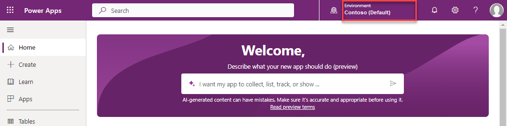

---
lab:
  title: Путь Обучение 1. Лаборатория 1.1. Работа с приложениями для взаимодействия с клиентами
  learning path: Explore the core capabilities of Microsoft Dynamics 365 customer engagement apps
  module: Describe the foundations of Dynamics 365 customer engagement apps
---

Путь Обучение 1 — модуль 1. Описание основы приложений Dynamics 365 для взаимодействия с клиентами
========================

## Практическая лабораторная работа 1.1. Работа с приложениями для взаимодействия с клиентами 

## Задачи

В этом упражнении вы узнаете, как получить доступ к различным приложениям Dynamics 365 для взаимодействия с клиентами и перейти к ним. 

## Исходные условия выполнения лабораторной работы

  - **Предполагаемое время**: 10 минут

## Instructions

1. Откройте браузер и перейдите по адресу [https://make.powerapps.com](https://make.powerapps.com/). 

2. Войдите с учетными данными, предоставленными инструктором. При первом входе вы перейдете в **среду Contoso (по умолчанию** ). Как правило, вы не будете работать в среде по умолчанию. Мы изменим ее на выделенную среду для обучения. 

3.  Используя селектор среды в верхней части, выберите среду **Contoso (по умолчанию).** 

4. В появившемся меню выберите выделенную среду обучения, отмеченную инструктором. (Для размещенных клиентов обучения среда, скорее всего, начнется с чего-то такого, как **WWLCLOUD.**)

5. После работы в правильной среде с помощью навигации слева выберите **"Приложения**". 

6. В списке приложений **** откройте **приложение Sales Hub**. В приложении можно работать с разными областями в зависимости от того, что вы пытаетесь сделать. Например, приложение Sales Hub содержит различные административные параметры, с которыми можно работать.

7. В левой нижней части экрана в нижней части области навигации слева или **карты сайта** выберите текст **"Продажи**" в появившемся списке выберите **приложение Параметры.** **Параметры** приложения — это место, где можно просматривать и вносить изменения в административные параметры. Обратите внимание, как изменились элементы навигации слева.

8. **Снова выберите селектор области** изменений и измените его с **приложения Параметры** обратно на **Sales**.

9. Если вы хотите перейти с приложения Sales на другое приложение, например рабочую область "Обслуживание клиентов", выберите **текст Центра** продаж в левой верхней части экрана рядом с текстом Dynamic 365.

10.  Откроется всплывающее **окно селектора приложений** , выберите **Центр** обслуживания клиентов и вы перейдете в **приложение Центра** обслуживания клиентов. Обратите внимание, что **Центр** обслуживания клиентов имеет различные области, доступные в **меню "Область изменений** ".

11. Чтобы вернуться в **приложение "Центр** продаж", выберите **текст Центра** обслуживания клиентов в верхней части **окна селектора приложений** . Выберите **Центр** продаж.

Кроме того, вы можете получить доступ к бизнес-приложениям на портале Office. 

1. Откройте браузер и перейдите по адресу [https://www.office.com/apps](https://www.office.com/apps). Здесь будут отображаться все приложения, к которым у вас есть доступ.

2. Выберите вкладку **Бизнес-приложения**, чтобы ограничить отображаемые приложения лишь бизнес-приложениями Dynamics 365.

3. Чтобы уменьшить количество отображаемых приложений, щелкните поле поиска, расположенное на верхнем экране.

4. Введите текстовый ****центр** продаж и выберите приложение "Центр** продаж", чтобы открыть его.

5. В приложении можно работать с разными областями в зависимости от того, что вы пытаетесь сделать. Например, приложение Sales Hub содержит различные административные параметры, с которыми можно работать.

6. В левом нижнем углу экрана выберите текст **Продажи**, в появившемся списке выберите **Настройки приложения**. В этой части приложения вы можете вносить в него административные изменения.

7. Снова выберите селектор области и измените его с **приложения Параметры** обратно на **Sales**.

8. Если хотите переключиться с приложения Sales на другое приложение, например на Customer Service Hub, выберите текст **Sales Hub** в верхней левой части экрана рядом с текстом «Dynamic 365».

9. Появится экран приложений, выберите **Customer Service Hub** и вы перейдете в приложение Customer Service Hub.

10. **Выберите текст Центра** обслуживания клиентов в верхней части, чтобы вернуться к **приложению Центра** продаж.
